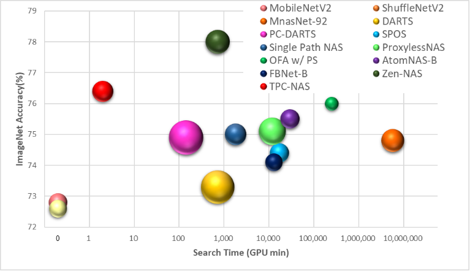

# TPC-NAS: Sub-Five-Minute Neural Architecture Search for Image Classification, Object-Detection, and Super-Resolution

# ImageNet Result


ImageNet accuracy for different NSA algorithms or man-made models. The x-coordinate is the search time, the y-coordinate is the performance of NAS on ImageNet, and the bubble size represents the model's FLOPs. Our TPC-NAS(red ball) can even achieve 76.4% ImageNet accuracy when the number of FLOPs is 355M, which outperforms most NAS algorithms. In addition, our search time is two orders less than other NAS algorithms. Hence, our NAS is very competitive in terms of search time and found models’ performance.

# Reproduce Paper Result
Download and unzip save_dir in the root of TPC-NAS from the link below:
https://drive.google.com/file/d/11RKw76fqSgtKMYrD-nqMC7LIUA28lwL9/view?usp=sharing

Change the data path in DataLoader

# Other Applications
super resolution: https://github.com/TPC-NAS/TPC_NAS_super_resolution
object detection: https://github.com/TPC-NAS/TPC_NAS_Object_Detection
natural language processing: https://github.com/TPC-NAS/TPC_NAS_Natural_Language_Model

## Testing
Test CIFAR10 and CIFAR100
```
sh scripts/TPC_NAS_cifar_params1M.sh
```

Test ImageNet
```
sh scripts/TPC_NAS_ImageNet_flops300M.sh
```

## Training
Modify the save_dir in the script and run the same command as testing.

Train CIFAR10 and CIFAR100 under 1M parameters size
```
sh scripts/TPC_NAS_cifar_params1M.sh
```

Train ImageNet under 300M flops
```
sh scripts/TPC_NAS_ImageNet_flops300M.sh
```

# Open Source
Some few files in this repository are modified from the following open-source implementations:
```
https://github.com/DeepVoltaire/AutoAugment/blob/master/autoaugment.py
https://github.com/VITA-Group/TENAS
https://github.com/SamsungLabs/zero-cost-nas
https://github.com/BayesWatch/nas-without-training
https://github.com/rwightman/gen-efficientnet-pytorch
https://pytorch.org/vision/0.8/_modules/torchvision/models/resnet.html
```
Most of the code thanks to the contribution of Zen-NAS
```
https://github.com/idstcv/ZenNAS
```

